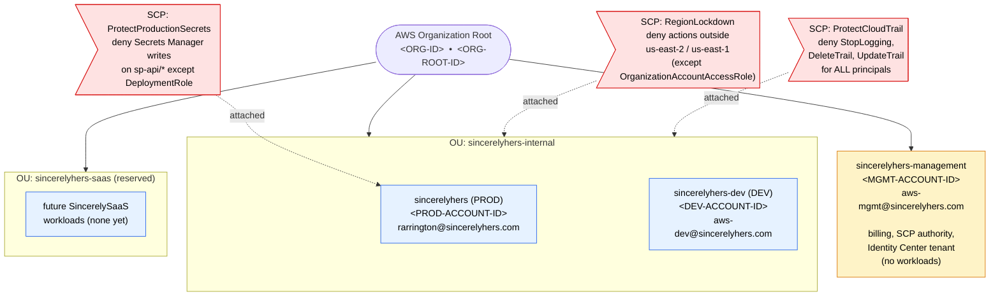
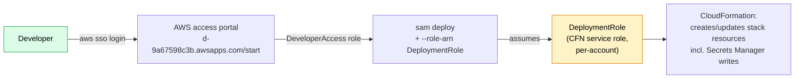

# AWS Organizations layout

The org structure for Sincerely Services AWS workloads. Three accounts under one Organization, two OUs, three SCPs, IAM Identity Center for human access. Authoritative status (applied IDs, attachment dates, last-verified timestamps) lives in [infrastructure/org-setup/README.md](../../infrastructure/org-setup/README.md). This page is the *shape*, not the *state*.

## Account tree, OUs, SCP attachments

OU IDs (referenced by the diagram below):

| OU | ID | Status |
|---|---|---|
| `sincerelyhers-internal` | `<INTERNAL-OU-ID>` | live — holds prod and dev |
| `sincerelyhers-saas` | `<SAAS-OU-ID>` | reserved — empty, future SincerelySaaS workloads |

## What each SCP does

| SCP | Attached to | Effect | Why |
|---|---|---|---|
| `RegionLockdown` | `sincerelyhers-internal` OU | Denies any action whose `aws:RequestedRegion` is not `us-east-2` or `us-east-1`. Excepts callers assuming `OrganizationAccountAccessRole` | Single-region cost discipline + smaller attack surface; us-east-1 carve-out for global services (IAM, STS, CloudFront) that route there |
| `ProtectCloudTrail` | `sincerelyhers-internal` OU | Denies `cloudtrail:StopLogging`, `DeleteTrail`, `UpdateTrail` for **all** principals (admins included) | Tamper-resistance for the audit log. Once a trail exists it cannot be silenced without management-level SCP detach |
| `ProtectProductionSecrets` | `sincerelyhers` (prod) account | Denies `secretsmanager:DeleteSecret`, `PutSecretValue`, `UpdateSecret` on `sp-api/*` unless caller is `DeploymentRole` | Production credential changes go only through `sam deploy` (via CloudFormation assuming DeploymentRole). Humans cannot write prod SP-API secrets even with admin perms |

Authoritative SCP JSON: [infrastructure/org-setup/scp-region-lockdown.json](../../infrastructure/org-setup/scp-region-lockdown.json), [scp-protect-cloudtrail.json](../../infrastructure/org-setup/scp-protect-cloudtrail.json), [scp-protect-production-secrets.json](../../infrastructure/org-setup/scp-protect-production-secrets.json).

## Identity Center — who can do what, where

IAM Identity Center is the only path for human console/CLI access. Tenant lives in `us-east-2`.

| Account | Permission sets assigned to your Identity Center user | What that grants |
|---|---|---|
| `sincerelyhers-dev` | `AdministratorAccess` (AWS managed) | Full perms in dev — for hands-on iteration |
| `sincerelyhers` (PROD) | `DeveloperAccess` (custom inline policy) + `ReadOnlyAccess` (AWS managed) | DeveloperAccess: read-only on stack-managed services + `lambda:InvokeFunction` + `cloudformation:*Stack*` + scoped `iam:PassRole` to DeploymentRole only. ReadOnlyAccess for services DeveloperAccess deliberately omits (notably `cloudtrail:*`) |
| `sincerelyhers-management` | `ReadOnlyAccess` | Org/Identity Center audit APIs that are management-only (`organizations:List*`, `sso-admin:List*`) |

Authoritative custom-policy source: [infrastructure/org-setup/permission-set-developer-access.json](../../infrastructure/org-setup/permission-set-developer-access.json).

## Deploy-time identity

The developer never has direct write access to `sp-api/*` Secrets Manager values in prod. Writes flow only through `DeploymentRole`, which is exempted by name in the `ProtectProductionSecrets` SCP.

## What's NOT here

- **Sub-account workload architecture** — see [02-amazon-runtime.md](02-amazon-runtime.md) for the Amazon platform's runtime topology.
- **Numeric state and applied dates** — see [infrastructure/org-setup/README.md](../../infrastructure/org-setup/README.md).
- **Cross-account peering / VPC topology** — none. This is a serverless monorepo; no VPCs are owned by these stacks.
