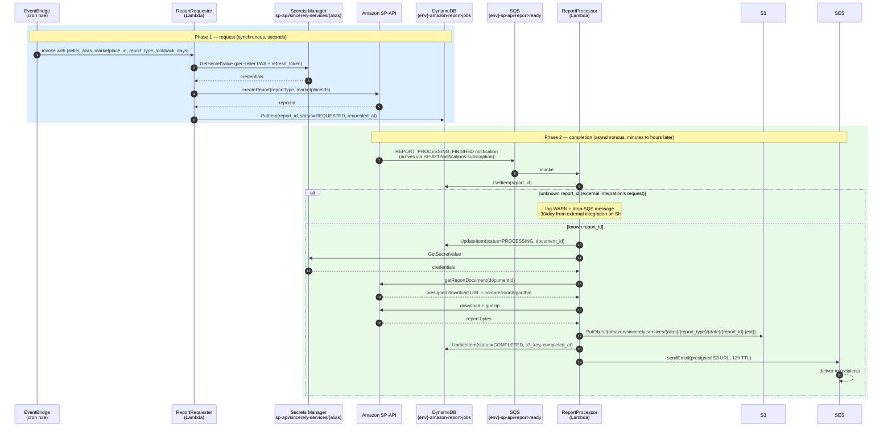
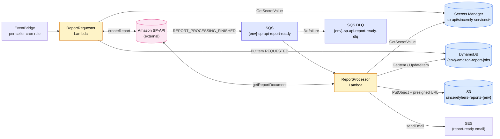

# Amazon platform runtime flow

How a scheduled SP-API report goes from EventBridge cron to email-delivered S3 link. Covers both phases of the asynchronous SP-API contract: the synchronous *request* and the eventually-arriving *completion notification*. Authoritative platform context lives in [platforms/amazon/CLAUDE.md](../../platforms/amazon/CLAUDE.md); this page is the runtime *shape*.

## Time-ordered flow

Key behaviors that the diagram only hints at:

- **Idempotent skip on unknown reportIds**: an external Sincerely-Services SPP-app integration also requests reports for SH. Their notifications arrive at our queue (Amazon delivers to whoever subscribed, app-wide). `ReportProcessor` looks up `report_id` in DynamoDB, gets `KeyError`, logs a warning, and drops the SQS message — no DDB write, no DLQ. Documented in [platforms/amazon/CLAUDE.md](../../platforms/amazon/CLAUDE.md) under "Environmental knowns".
- **DLQ on real failures**: SQS redrives 3× then sends to `{env}-sp-api-report-ready-dlq`. Retries help with transient SP-API throttling.
- **SES failure does not redrive**: by the time we email, the job is already `COMPLETED` in DynamoDB and the file is in S3. SES exceptions are caught and logged; the SQS message is acked.

> **Future direction.** Today every report — daily-scheduled and one-off — goes out via SES. Deferred plan ([cost-minimization-review.md, Idea D](../design/cost-minimization-review.md#idea-d-split-delivery-into-routine-webhook-vs-ad-hoc-ses)): split delivery into a **routine** path (EventBridge custom event → API destination → downstream webhook URL, with built-in retry) for machine-to-machine consumption, keeping **SES** strictly for the explicit human-request path. Don't extend the current SES flow as if it's the long-term routine channel.

## Resource topology

## Per-seller fan-out

Each onboarded seller adds three things, all per-alias:

1. A row in Secrets Manager: `sp-api/sincerely-services/{alias}/credentials` containing `client_id`, `client_secret`, `refresh_token`. Client ID + secret are the same across all sellers (one SPP app); refresh_token is per-seller.
2. An EventBridge rule in [platforms/amazon/template.yaml](../../platforms/amazon/template.yaml) targeting `ReportRequester` with the seller's input payload.
3. An SP-API notification subscription via `scripts/sp_api_notifications.py create-subscription {alias} {destinationId}`. The destination (an SP-API resource that points at our SQS queue) is reused across all sellers.

The `/onboard-amazon-seller` skill automates all three steps; it was used to bring `LLG`, `73J`, `OH`, `CO` online in dev alongside the original `SH` and `KK`.

## Locked decisions worth re-flagging

(Full list in [platforms/amazon/CLAUDE.md](../../platforms/amazon/CLAUDE.md). The ones a diagram-reader most likely wants to question:)

- **Why EventBridge `createReport` instead of SP-API's `createReportSchedule`?** We need explicit `dataStartTime`/`dataEndTime` window control (relevant for date-range reports; the FBA inventory snapshot ignores them but other reports won't). Schedule-side logic stays in our IaC instead of in Amazon's app context.
- **Why per-notification-type SQS queues with DLQs (not one shared queue)?** Decoupled retry semantics + clearer DLQ ownership when we add other notification types later.
- **Why `python-amazon-sp-api`?** Maintained, covers the endpoints we use, and handles the LWA token-exchange + signing dance we'd otherwise have to write.
