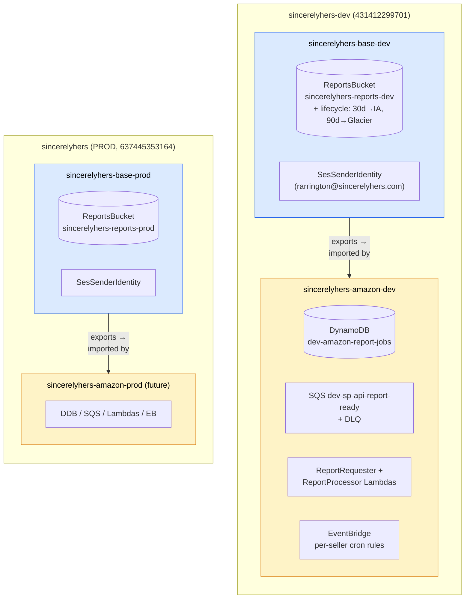
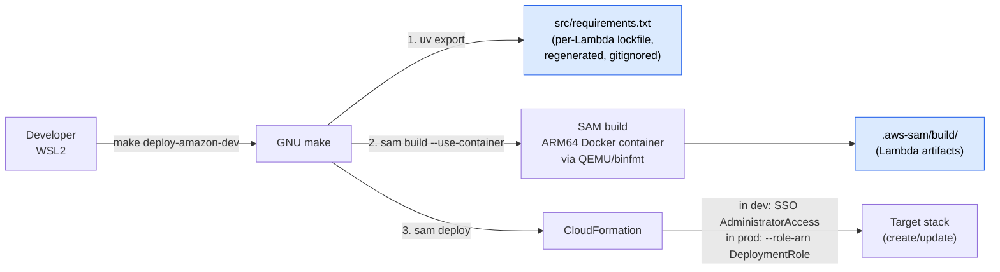
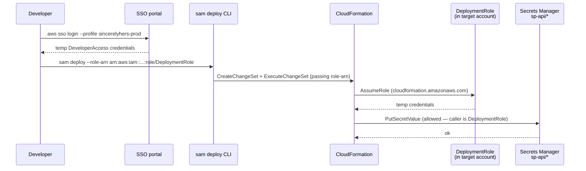

# IaC topology

How CloudFormation/SAM is organized across the monorepo, why it's split this way, and what flows through the system at deploy time. Authoritative templates: [infrastructure/base-stack.yaml](../../infrastructure/base-stack.yaml), [platforms/amazon/template.yaml](../../platforms/amazon/template.yaml), [infrastructure/org-setup/deployment-role.yaml](../../infrastructure/org-setup/deployment-role.yaml).

## Two-level stack pattern

Cross-cutting AWS resources live in a **base stack** deployed once per environment. Each **platform stack** deploys independently and imports what it needs via `Fn::ImportValue`. A broken Faire deploy can't block an Amazon hotfix because they're separate stacks.

### What the base stack provides

| Export | Resource | Used by |
|---|---|---|
| `ReportsBucketArn` | S3 bucket ARN | Platform Lambdas' `s3:PutObject`/`GetObject` IAM scoping (`${BucketArn}/amazon/*`) |
| `ReportsBucketName` | S3 bucket name | Lambda `REPORTS_BUCKET` env var (used in `PutObject(Bucket=...)` calls) |
| `SesSenderEmail` | Verified sender address | Lambda `SES_SENDER_EMAIL` env var (used as `Source` in `SendEmail`) |
| `SesSenderIdentityArn` | SES identity ARN | Lambda `ses:SendEmail` IAM scoping (only this identity, not all SES) |

Other shared resources (CloudWatch dashboards, future shared SES configuration sets, future shared Secrets Manager wrappers) land here in later passes.

### What stays platform-local

Per the per-platform locked decisions ([platforms/amazon/CLAUDE.md](../../platforms/amazon/CLAUDE.md)), platform stacks own:

- DynamoDB table(s)
- SQS queues + DLQs
- Lambda functions, execution roles, EventBridge rules
- Anything platform-specific that doesn't generalize

## Deploy flow per stack

There is no `make deploy` umbrella target — base and platform deploy independently on purpose.

Order matters in step 1: `uv export --frozen --no-dev` produces a per-Lambda `requirements.txt` that SAM uses for packaging. **Never edit this file manually** — it's a build artifact, gitignored, and overwritten on each build.

## DeploymentRole — why and how

In **prod**, the `ProtectProductionSecrets` SCP denies `secretsmanager:Put/Update/DeleteSecret` on `sp-api/*` for *every* principal except `arn:aws:iam::637445353164:role/DeploymentRole`. So `sam deploy` has to use it as the CloudFormation service role:

In **dev**, `ProtectProductionSecrets` doesn't apply. `sam deploy` works with or without `--role-arn`. We deployed `DeploymentRole` to dev anyway (2026-04-25) for **command-shape symmetry** — same `--role-arn` flag in dev as in prod, so when you copy a working dev command to prod nothing surprises you.

DeploymentRole permissions are pragmatic, not minimal:
- Broad on stack-managed services (`lambda`, `dynamodb`, `sqs`, `events`, `s3`, `ses`, `logs`, `cloudformation`)
- Scoped IAM role management on roles in the same account (for Lambda execution roles)
- Scoped Secrets Manager writes restricted to `sp-api/*`

Tighten once the deploy surface stabilizes.

## What's NOT here

- **Application runtime flow** — see [02-amazon-runtime.md](02-amazon-runtime.md).
- **SCP semantics** — see [01-organizations.md](01-organizations.md).
- **Secrets contents and auth flow** — see [04-secrets-and-auth.md](04-secrets-and-auth.md).
