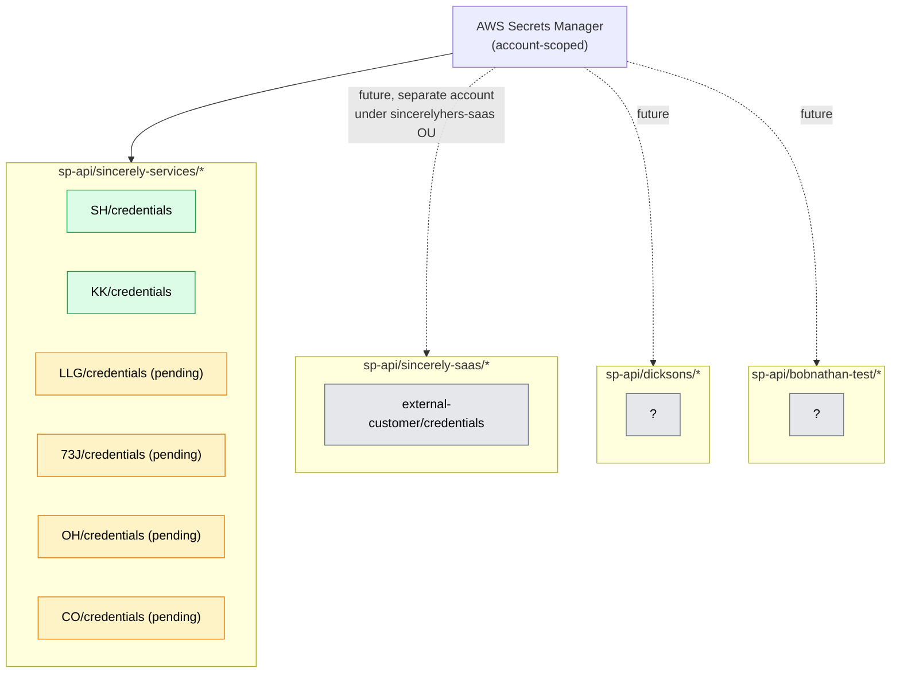
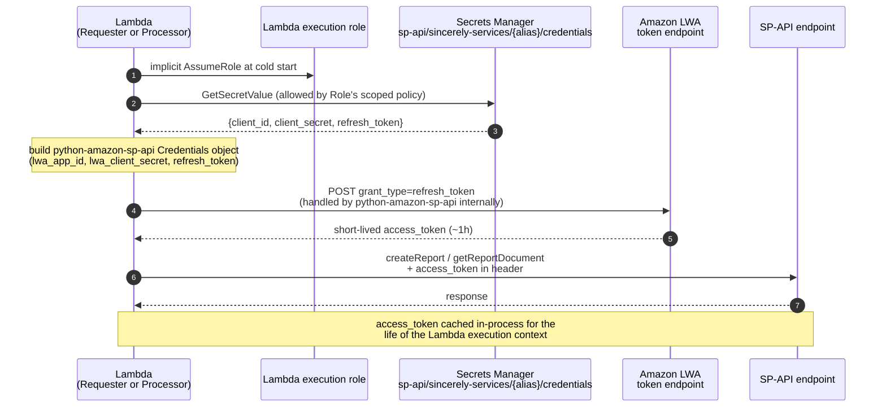

# Secrets and auth

How SP-API credentials are stored, scoped, and exchanged for runtime access tokens. Authoritative code: [platforms/amazon/src/sincerelyhers_amazon/credentials.py](../../platforms/amazon/src/sincerelyhers_amazon/credentials.py). Authoritative naming convention: [platforms/amazon/CLAUDE.md](../../platforms/amazon/CLAUDE.md) ("Secrets Manager Naming").

## Two layers of isolation

There are two orthogonal isolation boundaries to keep clear:

1. **SPP app isolation** — Sincerely Services operates four Solution Provider Portal (SPP) apps. Each owns its own secret-prefix namespace. A bug in one app's code path can never read another app's credentials.
2. **Per-seller isolation** — within a single SPP app, each onboarded seller's `refresh_token` lives in its own secret. The Lambda code path takes a `seller_alias` and resolves to exactly one secret.

SPP app namespaces (referenced by the diagram below):

| Secret prefix | SPP app | Status |
|---|---|---|
| `sp-api/sincerely-services/` | Sincerely Services (private) | deployed in dev today; same prefix in prod when cut over |
| `sp-api/sincerely-saas/` | SincerelySaaS (Ready For Publishing) | future — must live in a separate AWS account under the `sincerelyhers-saas` OU |
| `sp-api/dicksons/` | Dicksons SKU Checker (Draft) | future — account/OU placement deferred |
| `sp-api/bobnathan-test/` | BobNathan-Test (Draft) | dev/test only, not deployed |



## Per-seller secret shape

Each seller's secret at `sp-api/sincerely-services/{alias}/credentials` is a JSON blob with three fields:

| Key | Per | Source |
|---|---|---|
| `client_id` | App | LWA OAuth identifier issued by Amazon when the SPP app was created — same for every seller |
| `client_secret` | App | LWA OAuth secret issued at app creation — same for every seller |
| `refresh_token` | Seller | Returned at the end of the seller's "self-authorize" flow against the Sincerely Services SPP app — unique per seller |

`client_id` + `client_secret` are duplicated into every per-seller secret rather than living in a separate "app-level" secret. Slightly redundant; intentional — each seller's secret is fully self-contained, no second `GetSecretValue` round-trip at runtime, no app-level secret to forget about during onboarding.

## Lambda execution role scoping

Both Lambdas (`ReportRequester`, `ReportProcessor`) get `secretsmanager:GetSecretValue` scoped to a single prefix:

```yaml
Action: secretsmanager:GetSecretValue
Resource: !Sub "arn:aws:secretsmanager:${AWS::Region}:${AWS::AccountId}:secret:${SecretsPrefix}/*"
```

Where `SecretsPrefix` defaults to `sp-api/sincerely-services` (template parameter, overridable). A future SincerelySaaS Lambda would deploy with `SecretsPrefix=sp-api/sincerely-saas` and physically cannot read Sincerely Services credentials — even though both Lambdas might run in the same broader environment, they're in different AWS accounts (per the SPP app isolation rule, SincerelySaaS lives in a separate account under the `sincerelyhers-saas` OU).

> **Future direction.** Secrets Manager at $0.40/secret/mo is the only cost line that scales linearly with seller/customer count. Two deferred decisions ([cost-minimization-review.md](../design/cost-minimization-review.md#where-the-actual-savings-live)): (a) **SSM Parameter Store SecureString** as a cheaper backing store for refresh tokens that don't auto-rotate, and (b) **per-app token consolidation** for SaaS-tier customer counts where per-secret cost becomes meaningful. Neither is built. Don't change today's per-seller secret layout without re-reading those tradeoffs first — security boundary > $2/mo savings at current scale.

## Runtime auth flow

The sequence below shows what happens *inside* either Lambda when it needs to call SP-API. `python-amazon-sp-api` handles the LWA token exchange transparently — we hand it a credentials dict and it does the rest.



Key properties:

- **Refresh tokens are long-lived but bound to one app.** They're issued only when the seller authorizes the Sincerely Services SPP app from their Seller Central. If the seller revokes, every refresh token issued for them against this app dies; they have to re-authorize.
- **LWA access tokens are short-lived.** The library re-mints them transparently when they expire mid-Lambda-execution.
- **No human ever holds an access token.** Humans hold SSO sessions; only Lambda execution roles can read the refresh tokens that mint access tokens.

## What humans cannot do (in prod)

Per the `ProtectProductionSecrets` SCP attached to the prod account:

- Cannot `PutSecretValue`, `UpdateSecret`, or `DeleteSecret` on `sp-api/*` from any human SSO session, including AdministratorAccess (admin in dev only) or DeveloperAccess (prod). Only `DeploymentRole` (assumed by CloudFormation during `sam deploy`) is exempted.
- Cannot read `secretsmanager:GetSecretValue` either — `DeveloperAccess` deliberately omits this. Lambdas read at runtime; humans never see the secret values.

In **dev** the SCP doesn't apply — admins can rotate secrets manually for testing. Production secret rotation is a future-pass task; today the assumption is that refresh tokens persist until a seller revokes the app.

## What's NOT here

- **The pipeline that consumes these credentials** — see [02-amazon-runtime.md](02-amazon-runtime.md).
- **Stack/IAM scoping mechanics** — see [03-iac-topology.md](03-iac-topology.md).
- **SCP rule text** — see [01-organizations.md](01-organizations.md).
